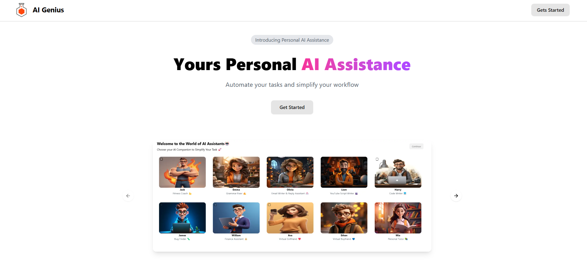
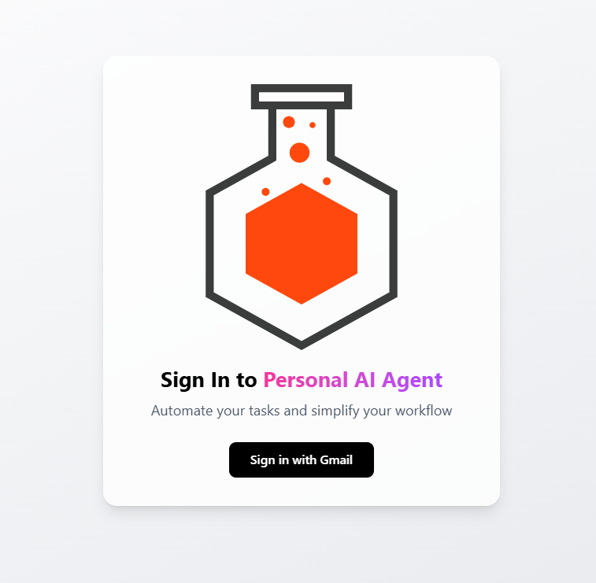
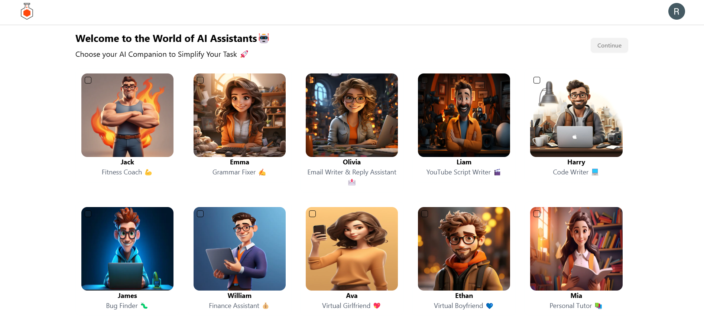
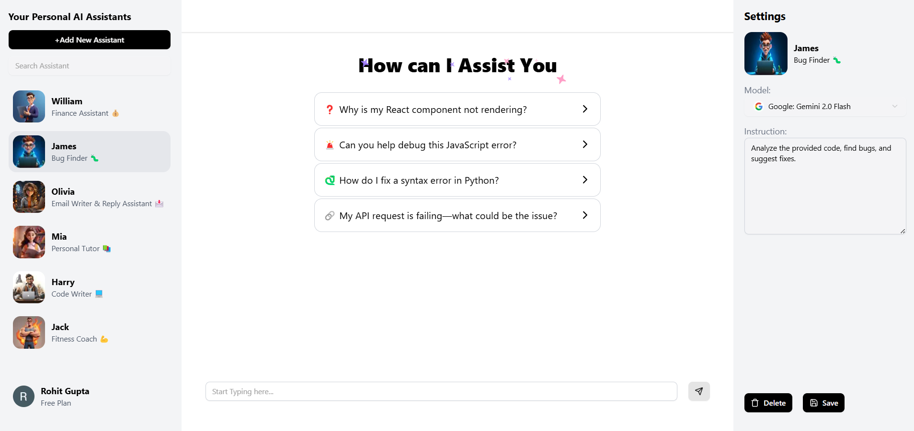

# Personal AI Assistants

Welcome to the Personal AI Assistants project! This application allows users to select and interact with various AI assistants. Built with Next.js, it integrates theme management, Google OAuth authentication, and Convex backend services for a seamless user experience.

## 📸 Screenshots

<table>
  <tr>
    <td><strong>Home Page</strong></td>
    <td><strong>Login Screen</strong></td>
  </tr>
  <tr>
    <td></td>
    <td></td>
  </tr>
  <tr>
    <td><strong>AI Assistant Selection</strong></td>
    <td><strong>Workspace</strong></td>
  </tr>
  <tr>
    <td></td>
    <td></td>
  </tr>
</table>

## 📚 Table of Contents

- [Features](#-features)
- [Technologies Used](#-technologies-used)
- [Project Structure](#project-structure)
- [Getting Started](#getting-started)
  - [Prerequisites](#prerequisites)
  - [Installation](#installation)
  - [Environment Setup](#environment-setup)
- [Usage](#usage)
- [Contributing](#contributing)
- [License](#license)

---

## ✨ Features

- **AI Assistant Selection** – Choose from a variety of AI assistants to help with different tasks  
- **Google OAuth Authentication** – Securely sign in using your Google account  
- **Theme Management** – Switch seamlessly between dark and light themes  
- **Convex Backend Integration** – Efficiently manage user data and interactions  
- **Responsive Design** – Works on desktop and mobile devices  

---

## 🛠 Technologies Used

### Frontend
- **Next.js** – React framework for server-side rendering and static site generation  
- **React** – JavaScript library for building user interfaces  
- **Next Themes** – Theme management for Next.js applications  
- **Tailwind CSS** – Utility-first CSS framework  

### Backend
- **Convex** – Backend services for managing user data and interactions  

### Authentication
- **Google OAuth** – Authentication using Google accounts  

---

## 📁 Project Structure
```bash
Personal_AI_Assistants
├── .env.local
├── package.json
├── README.md
├── app
│   ├── (main)
│   │   └── ai-assistants
│   │       └── page.tsx
│   └── provider.tsx
├── components
│   ├── ui
│   │   ├── button.tsx
│   │   └── checkbox.tsx
│   └── magicui
│       ├── blur-fade.tsx
│       └── rainbow-button.tsx
├── context
│   └── AuthContext.tsx
├── services
│   └── AiAssistantsList.ts
└── public
    └── images

```


---

## 🚀 Getting Started

### Prerequisites

Before you begin, ensure you have the following installed:
- **Node.js** (v14 or higher)
- **npm** or **yarn**

### Installation

1. **Clone the repository**:
   ```bash
   git clone https://github.com/Rohit1608/Personal_AI_Assistants.git
   cd Personal_AI_Assistants
2. **Install dependencies**:
npm install
 or
yarn install

3. **Environment Setup**:
NEXT_PUBLIC_CONVEX_URL=<your-convex-url>
NEXT_PUBLIC_GOOGLE_CLIENT_ID=<your-google-client-id>

### 🖥 Usage

1. **Start the development server**:
npm run dev
 or
yarn dev

2. **Open your browser and navigate to http://localhost:3000
3. **Sign in with your Google account**
4 **Select an AI assistant to start interacting**
